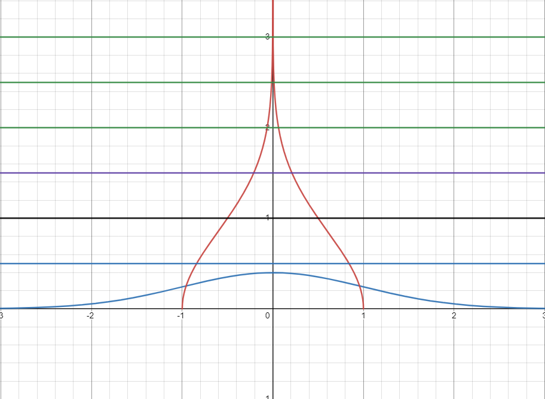

# NormalDistributionNumGet
https://www.desmos.com/calculator/kuntqqemss

An attempt of getting random numbers from Normal Distribution (sigma = 1, mu = 0) without calling the Box-Muller method with a custom deviation.

In order to get random numbers, you must adjust variables k, l and z depending on your needs (test on the upper link in desmos) from the formula:

Here are some good values to use:

1)

     >(0,1] - 50.00%                  - AVG = 1.065
     
     >(1,2] - 43.70%  
     
    >(2,+inf) -  6.30%
 
  l = 0.15915
  
  k = 2
  
  z = 0.722
  
 2)
 
     >(0,1] - 68.26%   (in this setup, in this range the chance become slightly uniform) - Avg = 0.673
     
     >(1,2] - 27.20%
     
     >(2,+inf) -  4.20%
 
 
  l = 0.15915
  
  k = 1.061
  
  z = 0.3373
  
   3)
 
     >(0,1] - 68.26%   (in this setup, chances for numbers too large decreases drastically) - Avg = 0.725
 
  l = 0.15915
  
  k = 2
  
  z = 0.3373
  
  
  l - decrease the input range (for l = 0.15915 the input range is [0,1]
  
  k - decrease the chance of large number 
    - decrease the chance of small numbers
    - chance of 1 remains still, regardles of any modifier
    - by decrease, the chance in range [0,1] becomes uniform/liniar
    
  z - increase the change of large numbers
  
    
     
     
