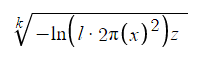

# NormalDistributionNumGet
https://www.desmos.com/calculator/kuntqqemss

An attempt of getting random numbers from Normal Distribution (sigma = 1, mu = 0) without calling to Box-Muller method.

In order to get random numbers, you must adjust variables k, l and z depending on your needs from the formula:

Here are some good values to use:
1)
     (0,1] - 50.00%
     (1,2] - 43.70%
  (2,+inf) -  6.30%
  
  l = 0.15915
  k = 2
  z = 0.722
  
 2)
     (0,1] - 68.26%   (on this setup, in this range the chance become slightly uniform)
     (1,2] - 27.20%
  (2,+inf) -  4.20%
  
  l = 0.15915
  k = 1.061
  z = 0.3373
  
  
    
     
     
