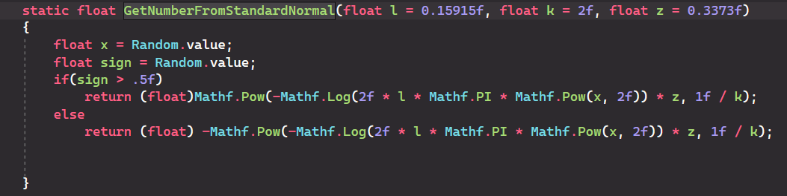

1)Create a method that returns a float number

2)Save in a variable a Random value in range [0,1]

3)Return the function, by replacing l, k and z with your needful parameters and x by your random number.

Example in C#:

